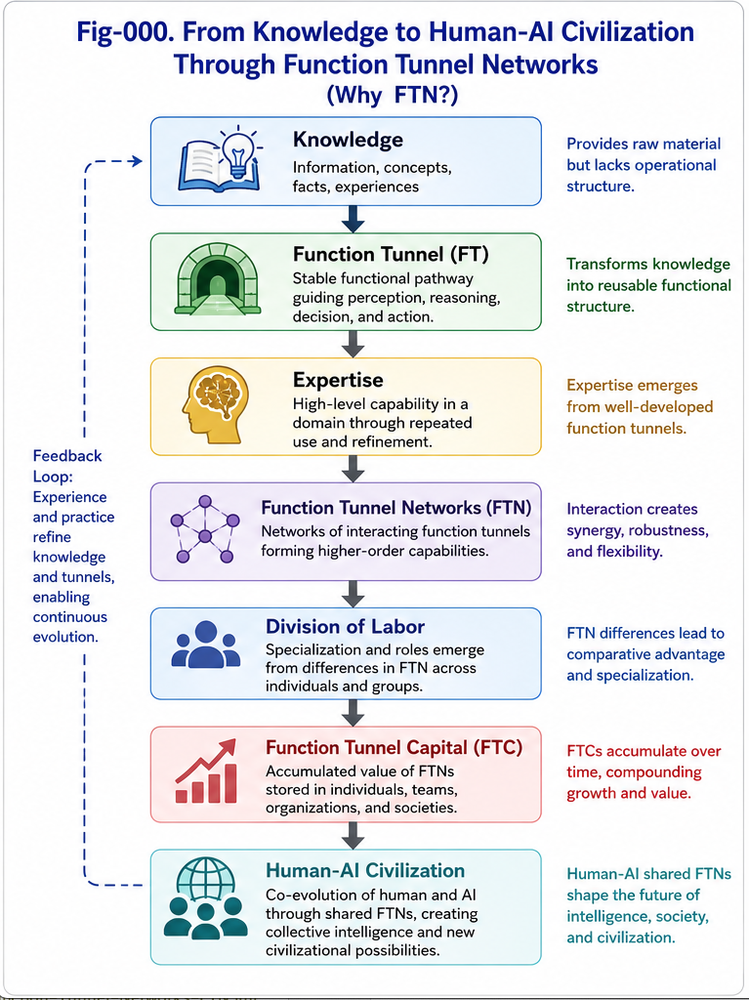
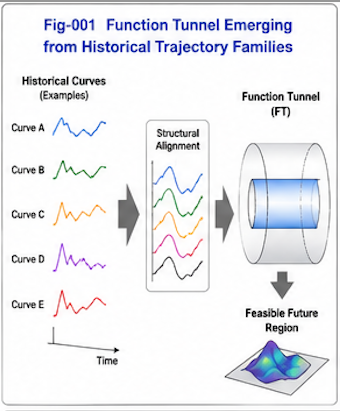
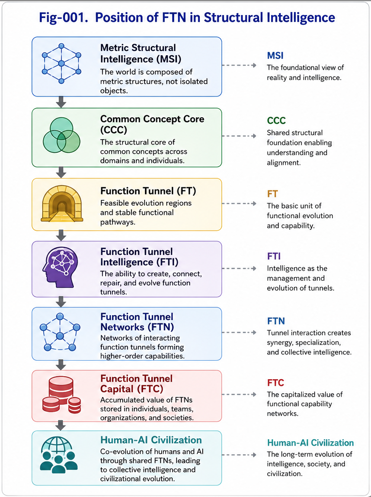
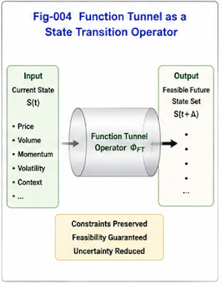
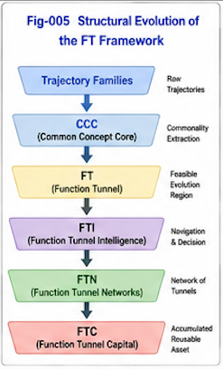
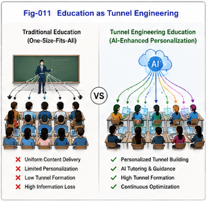
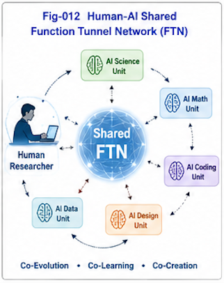
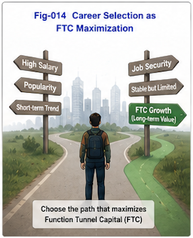

# Function Tunnel Networks (FTN)

## A Structural Perspective on Intelligence, Education, Division of Labor, and Human-AI Co-Evolution

---



---

## Core Thesis

Human intelligence is not merely the accumulation of knowledge.

It emerges through the formation of stable functional pathways that guide perception, reasoning, learning, decision making, and adaptation.

We call these pathways **Function Tunnels (FT)**.

As Function Tunnels accumulate, interact, and reinforce one another, they form **Function Tunnel Networks (FTN)**.



This repository explores the hypothesis that:

- learning,
- expertise,
- specialization,
- education,
- division of labor,
- comparative advantage,
- collective intelligence,
- and Human-AI collaboration

can all be understood as consequences of the formation and evolution of Function Tunnel Networks.

---



---

## Motivation

Traditional explanations often focus on:

- knowledge,
- information,
- skills,
- incentives,
- intelligence,
- talent,
- education.

While each perspective captures part of reality, they do not fully explain:

- why individuals exposed to similar environments develop different capabilities,
- why professions naturally emerge,
- why expertise compounds over time,
- why some educational approaches are dramatically more effective,
- why Human-AI collaboration can become increasingly productive.

FTN proposes that the missing component may be the formation, evolution, and accumulation of Function Tunnels.



---

## The FT Framework



The FT framework consists of four progressively larger concepts:

```text
Function Tunnel (FT)
          ↓
Function Tunnel Intelligence (FTI)
          ↓
Function Tunnel Networks (FTN)
          ↓
Function Tunnel Capital (FTC)
```
### FT

A reusable functional pathway supporting perception, reasoning, decision making, learning, or action.

### FTI

The ability to construct, maintain, repair, connect, and evolve Function Tunnels.

### FTN

The network formed by interacting Function Tunnels.

### FTC

The accumulated value of Function Tunnel Networks.

## Key Ideas

### Knowledge Feeds FT but Is Not FT

Knowledge provides material.

Function Tunnels provide operational structure.

### Education as Tunnel Engineering



Education is not merely content delivery.

Education is the construction and refinement of Function Tunnels.

### Division of Labor as FTN Emergence

Professional specialization and comparative advantage emerge from differences in FTC.

### Human-AI Shared FTNs



Human-AI collaboration can produce shared Function Tunnel Networks that exceed the capabilities of either participant alone.

### Career Selection as FTC Maximization



In the AI era, career selection may increasingly become a problem of maximizing Function Tunnel Capital.

## Repository Structure

    FTN-001  Why Function Tunnel Networks?
    
    FTN-002  Foundations of FT, FTI, FTN, and FTC
    
    FTN-002A Function Tunnel as an Operator
    
    FTN-003  Division of Labor and Comparative Advantage
    
    FTN-004  Education as Tunnel Engineering
    
    FTN-005  Human-AI Co-Evolution through Function Tunnel Networks
    
    FTN-006  Function Tunnel Capital and Career Selection
    
    FTN-007  Open Questions and Future Directions

## Relationship to Other Structural Intelligence Research

This repository extends previous Structural Intelligence research including:

- Differential Trees
- Metric Differential Trees (MDT)
- Common Concept Core (CCC)
- Function Tunnel Intelligence (FTI)
- Autonomous Structural Intelligence (ASI)
- Task-Action Dual Calling Graphs (TAD-CG)
-- Human-AI Hybrid Civilization

FTN focuses on the social, educational, organizational, and civilizational implications of Function Tunnels.

## Open Research Program

FTN is not presented as a finished theory.

Many questions remain open:

- Can Function Tunnels be measured?
- Can FTC be quantified?
- How are Function Tunnels formed?
- What is the relationship between FT and neuroscience?
- How do Human-AI FTNs evolve?
- Can AI autonomously develop FTNs?

This repository serves as an open research framework for exploring these questions.

## Vision

The long-term goal of FTN is not merely to understand intelligence.

It is to understand how intelligence grows, specializes, collaborates, accumulates, and co-evolves across:

- individuals,
- organizations,
- societies,
- AI systems,
- and future Human-AI civilizations.

---

## Author

Sizhe Tan\
Independent Researcher

GPT-Obot\
AI Research Assistant

2026

## Citation

DOI: TBD

## License

Apache-2.0

---

## 📚 DBM-SI Series Navigation

See:\
[./docs/DBM-SI-Series-of-gitHub-Repositories/DBM-SI-Series-of-gitHub-Repositories.md](./docs/DBM-SI-Series-of-gitHub-Repositories/DBM-SI-Series-of-gitHub-Repositories.md)

[./docs/DBM-SI-Series-of-gitHub-Repositories/DBM-SI-Structural-Intelligence-Dictionary-(v2).md](./docs/DBM-SI-Series-of-gitHub-Repositories/DBM-SI-Structural-Intelligence-Dictionary-(v2).md)
