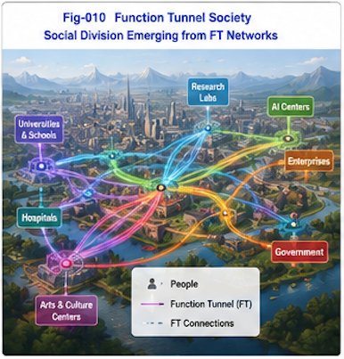

# FTN-001 - Why Function Tunnel Networks?
## A Structural Perspective on Intelligence, Education, Division of Labor, and Human-AI Co-Evolution

## Introduction

Human civilization is built upon learning, specialization, cooperation, and the continuous accumulation of knowledge and skills.

Traditional explanations often describe these phenomena in terms of:

- intelligence,
- talent,
- education,
- information,
- knowledge,
- experience,
- or economic incentives.

While each of these perspectives captures part of reality, none fully explains why individuals exposed to similar environments often develop dramatically different abilities, behaviors, and life trajectories.

This repository explores a different hypothesis.

We propose that many aspects of intelligence and civilization may be understood through the formation and evolution of stable functional pathways called Function Tunnels (FT).

## Core Observation

Knowledge alone does not explain competence.

Two students may attend the same school, read the same textbooks, and receive the same instruction.

Years later:

- one becomes an exceptional engineer,
- another becomes a successful entrepreneur,
- another becomes a musician,
- another struggles to apply what was learned.

The difference often cannot be explained solely by the amount of knowledge acquired.

Something deeper appears to be occurring.

We hypothesize that individuals gradually construct different Function Tunnels through experience, practice, education, environment, and biological predispositions.

These tunnels shape:

- perception,
- attention,
- decision making,
- learning efficiency,
- behavioral tendencies,
- and future development.

## Beyond Individual Intelligence

Function Tunnels do not exist only inside individuals.

Groups, organizations, professions, scientific communities, and entire civilizations may also be viewed as large-scale networks of interconnected functional pathways.

This leads naturally to the concept of Function Tunnel Networks (FTN).

Under this view:

- expertise emerges from FT accumulation;
- specialization emerges from FT divergence;
- collaboration emerges from FT connectivity;
- civilization evolves through FTN expansion.

## Human-AI Co-Evolution

The emergence of AI introduces a new possibility.

Function Tunnel Networks are no longer purely human.

Human and AI systems can jointly create, maintain, expand, and optimize shared FTNs.

The future may therefore be characterized not by AI replacing humans, but by the emergence of Human-AI Function Tunnel Networks.

Understanding these structures may become increasingly important for education, career development, organizational design, and future civilization.

## Purpose of This Repository

This repository is not intended to provide a complete theory.

Instead, it serves as:

- a conceptual framework,
- an open research program,
- and a discussion platform

for exploring how Function Tunnels and Function Tunnel Networks may help explain intelligence, learning, specialization, collective behavior, and Human-AI co-evolution.